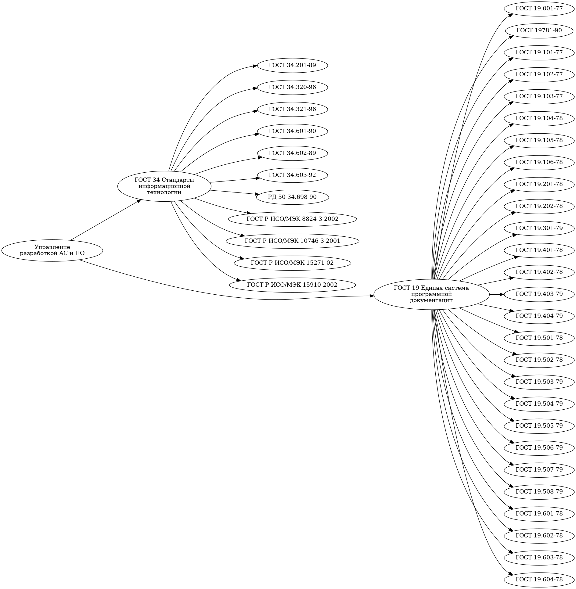
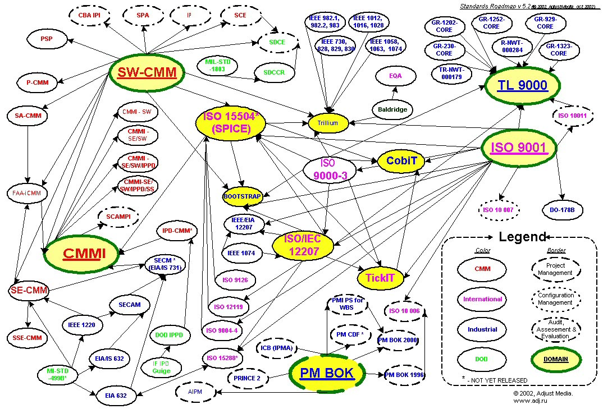

# Основы управления проектами

## Bведение в управление проектами

### Основные стандарты, методы и технологии, общепринятые в управлении проектами по разработке программного обеспечения и внедрению информационных систем;

#### ГОСТ 34 и ГОСТ 19

ГОСТ 34 описывает стандарты информационных технологий, а именно: виды, комплектность и обозначения документов при создании автоматизированных систем (ГОСТ 34.201-89); концепции и терминология для концептуальной схемы и информационной базы (ГОСТ 34.320-96); информационные технологии, системы стандартов по базам данных, эталонные модели управления (ГОСТ 34.321-96); стадии создания автоматизированных систем (ГОСТ 34.601-90); правила написания технических заданий на создание автоматизированной системы (ГОСТ 34.602-89); виды испытаний автоматизированных систем (ГОСТ 34.603-92) и другие аспекты.

Часть стендартов группы 34 совместима с международными: абстрактная синтаксическая нотация (ГОСТ Р ИСО/МЭК 8824-3-2002), управление данными и открытая распределенная обработка (ГОСТ Р ИСО/МЭК 10746-3-2001) жизненный цикла программных средств (ГОСТ Р ИСО/МЭК 15271-02), процесс создания документации пользователя программного средства  (ГОСТ Р ИСО/МЭК 15910-2002).

ГОСТ 19 описывает единую систему программной документации (ЕСПД) и состоит из следующих частей: общие положения (ГОСТ 19.001-77), термины и определения. (ГОСТ 19781-90), виды программ и программных документов (ГОСТ 19.101-77), стадии разработки (ГОСТ 19.102-77), общие требования к программным документам (ГОСТ 19.105-78), требования к содержанию и оформлению  ехнического задания (ГОСТ 19.201-78), требования к содержанию и оформлению методики испытаний (ГОСТ 19.301-79). А также требования к содержанию и оформлению "Руководства системного программиста" (ГОСТ 19.503-79), "Руководства программиста"  (ГОСТ 19.504-79), "Руководства оператора" (ГОСТ 19.505-79) и других документов.

Отдельно рассматривается ГОСТ 19.701-90 схемы алгоритмов, программ, данных и систем, условные обозначения и правилав ыполнения. Он описывает правила графического представления программной документации и будет рассмотрен ниже.

#### Стандарты ISO серии 9000

Стандарты международной организации по стандартизации ISO являются наиболее известными и распространенными в мире. Стандарты ISO универсальны, их можно применять в качестве моделей независимо от отрасли, в которой функционирует компания. В следствие этого у модели ISO есть свои неоспоримые преимущества и недостатки.

Но основным преимуществом модели ISO является известность, распространенность, признание на мировом уровне. Сейчас стандарты ISO являются обязательным минимумом который должна иметь любая организация существующая на рынке. Но конечно же, вследствие своей универсальности, модель на основе стандартов ISO серии 9000 получилась достаточно “высокоуровневой”

Поэтому для построения полноценной системы качества, основанной на модели ISO, необходимо использовать большое количество вспомогательных отраслевых и ISO стандартов.

#### Стандарт TickIT

Достаточно широкую известность получил британский стандарт TickIT. Этот отраслевой стандарт регламентирует требования к системе качества для организаций разработчиков программного обеспечения и базируется на модели ISO 9001:94. В отличие от модели ISO 9001, которая регламентирует “что необходимо сделать”, разработчики данного стандарта попытались ответить на вопрос “как” можно выполнить требования, определенные в ISO 9001. TickIT объединяет в себе модель ISO 9001 с набором рекомендательных стандартов ISO 12207 и ISO 9000-3.

#### Стандарты SEI SW-CMM

Очень интересный подход к улучшению внутренних процессов разработки программного обеспечения определен в модели SEI SW-CMM. В основу данной модели (также как и в основу стандартов ISO серии 9000) положена теория TQM. Теория TQM основывается на постепенном улучшении внутренних производственных процессов за счет множества небольших внедряемых в компании улучшений. Однако, модели ISO и CMM несколько различаются в своих подходах к построению самосовершенствующихся систем управления качеством и улучшению производственных процессов.

В отличие от модели ISO, где для того, чтобы соответствовать требованиям, необходимо продемонстрировать 100%-ное соответствие модели (и только оно позволяет компании самосовершенствоваться), в модели SEI SW-CMM предусмотрен поэтапный подход к построению системы совершенствования процессов. Для достижения этой цели разработчики стандарта СММ определили пять уровней, которые должна пройти организация для того, чтобы достичь основной цели – повышения эффективности функционирования процессов компании и, как следствие, улучшения качества результатов производственных процессов и разрабатываемого программного обеспечения.

#### Стандарты по Project Management

Одним из важных моментов, который необходимо иметь в виду при внедрении каких-либо стандартов (ISO 9000, SEI SW-CMM, TickIT, Spice ISO 15504 и т.п.), связан с тем, что структура производства компаний, разрабатывающих программное обеспечение, связана со спецификой продукта. Каждый продукт, разрабатываемый IT-компанией, уникален. И для его разработки, как правило, используется проектный тип организации производства, который тесно связан с матричной структурой управления проектами.

Управление проектами – это приложение знаний, опыта, методов и средств к работам проекта для удовлетворения требований, предъявляемых к проекту, и ожиданий участников проекта. Чтобы удовлетворить эти требования и ожидания, необходимо найти оптимальное сочетание между целями, сроками, затратами, качеством и другими характеристиками проекта.

176 комитет ISO разработал рекомендательный стандарт ISO 10006 “Менеджмент качества. Руководство качеством при управлении проектами”, который определяет основные подходы к управлению проектами и определяет его место в модели обеспечения качеством. Авторы стандартов ISO серии 9000 определяют процесс управления проектами как часть системы менеджмента качества. С другой стороны, возможен и противоположный взгляд (которого придерживаются оппоненты стандартов ISO серии 9000), согласно которому менеджмент качества является одной из составной частей системы управления проектами.

Управление проектами является скелетом производства в организациях разработчиков программного обеспечения. Поэтому неудивительно, что для приведения в соответствие системы управления качеством производства к требованиям модели ISO 9001 и к требованиям модели улучшения процессов производства SEI SW-CMM использование стандартов и признанных в мире технологий по управлению проектами является краеугольным камнем развития внутренних технологий в IT-компаниях.

### Основы итерационного планирования и выполнения проектов;

### Основы управления изменениями и конфигурациями проекта по разработке информационных систем;

### Основы управления рисками проекта;

### Основы управления качеством проекта;

### Состав и содержание проектной документации внедрения информационных систем.

### Заинтересованные стороны проекта. Определение заинтересованных сторон проекта.

### Цели организации. Цели проекта. Цели заинтересованных сторон проекта. Основные ошибки при постановке целей проекта.

### Результаты проекта. Виды результатов проекта. Требования к результату проекта.

### Жизненный цикл проекта. Фазы проекта. Начальные, промежуточные и завершающие фазы проекта.

### Группы процессов управления проектами

### Системы управления проектами

## Практическое занятие.

Разработка устава проекта. Определение целей проекта создания ИС и требований к результату проекта. Определение профилей заинтересованных сторон проекта создания ИС.

# Обзор современных подходов к управлению технологическими процессами создания ИС

## Жизненный цикл информационной системы

## Классические и гибкие (Agile) подходы к реализации процессов создания ИС

## Управление анализом предметной области

## Управление анализом требований на ИС

## Разработка плана управления требованиями.

## Управление архитектурой, проектированием и реализацией ИС

## Управление испытаниями ИС. Виды испытаний. Эксплуатационные испытания и ввод в промышленную эксплуатацию.

## Управление развертыванием ИС

## Разработка плана управления внедрением ИС.

## Практическое занятие.

Определение задач, артефактов и ролей технологического процесса создания ИС (анализа предметной области, инженерии требований к ИС, разработки архитектуры ИС, проектирования и реализации ИС, испытаний ИС, развертывания ИС).

# Особенности управления проектами создания ИС

## Общий ход планирования и контроля проекта. Определение иерархической структуры работ (ИСР) проекта.

## Итерационное планирование.

## Инкрементальное (гибкое, Agile) планирование.

## Оценка сроков и трудозатрат в проектах по разработке ИС.

## Ресурсное планирование проекта. Планирование человеческих ресурсов. Мотивация и повышение ответственности команды внедрения.

## Оценка себестоимости проекта. Бюджетирование проекта внедрения ИС.Оценка эффективности проекта внедрения ИС

## Контроль изменений в проекте.

## Управление качеством создания ИС

## Управление рисками проекта. Что не является причинами неэффективного внедрения ИС.

## Контроль хода проекта. Что делать, если сроки срываются.

